# 项目名称
**零件交易系统** 

- [项目名称](#项目名称)
- [项目介绍](#项目介绍)
- [技术栈](#技术栈)
  - [前端](#前端)
  - [后端](#后端)
- [核心功能](#核心功能)
- [项目亮点](#项目亮点)
- [本地运行方式](#本地运行方式)
  - [一、前端代码运行说明](#一前端代码运行说明)
    - [1. 依赖环境](#1-依赖环境)
    - [2. 本地运行步骤](#2-本地运行步骤)
  - [二、后端代码运行说明](#二后端代码运行说明)
    - [1. 前置准备](#1-前置准备)
      - [（1）阿里平台相关配置](#1阿里平台相关配置)
      - [（2）数据库配置](#2数据库配置)
    - [2. 本地运行步骤](#2-本地运行步骤-1)
- [项目部分运行截图](#项目部分运行截图)
- [说明](#说明)

# 项目介绍
本项目是一个前后端分离的小型管理 + 智能客服系统，作为课程设计与个人实战项目，实现了基础管理功能与 AI 智能对话能力，可本地完整运行与演示。

# 技术栈

## 前端
Vue3
Vue Router
Pinia
Axios
Element Plus

## 后端
Java
Spring Boot
Spring MVC
Spring AI
Spring AOP
JWT
MyBatis
Aliyun OSS
MySQL

# 核心功能
多角色用户注册、登录
基础数据增删改查
集成 Spring AI + Tools Calling 的智能客服对话、工具调用、自动回复

# 项目亮点
完整前后端分离架构
独立完成前端 + 后端全流程开发
结合当下主流 AI 能力，实战性强
代码结构清晰，注释规范，可直接本地运行

# 本地运行方式

## 一、前端代码运行说明

### 1. 依赖环境
- Node.js 版本：v18.16.0

- npm（包管理工具）版本：9.6.6

### 2. 本地运行步骤
1. 将代码文件拷贝到本地文件夹下

2. 使用 VS Code 打开并进入项目根目录

3. 打开命令行窗口，执行以下命令安装所需依赖：

    ```Bash
    npm install
    ```

4. 依赖安装完成后，执行以下命令启动开发服务器：

    ```Bash
    npm run dev
    ```

5. 启动成功后，可在浏览器访问以下地址：

    ```Plain Text
     http://localhost:5173/
    ```

## 二、后端代码运行说明

### 1. 前置准备

#### （1）阿里平台相关配置
1. 登录阿里平台：[https://www.aliyun.com/](https://www.aliyun.com/)

2. OSS 对象存储配置（环境变量中设置以下参数）：

    ```Plain Text
    ENDPOINT=https://oss-cn-beijing.aliyuncs.com;
	BUCKET_NAME=你的bucketName;
	REGION=你的bucket所在地区（上面的endpoint也需要对应）
    ```

    注：OSS 配置具体详细过程此处省略

3. 大模型服务平台百炼配置：

    - 创建个人密钥

    - 在环境变量中配置以下参数：

        ```Plain Text
        QWEN_API_KEY=你的api-key
        ```

#### （2）数据库配置
1. 创建数据库 `part_trade_system`

2. 通过提供的 SQL 文件创建对应数据库表（含以下测试数据）：

    - 管理员账号：root，密码：1234

    - 顾客账号：顾客小明，密码：1234

    - 供应商账号：供应商小明，密码：1234

### 2. 本地运行步骤
1. 将代码文件拷贝到本地文件夹下

2. 使用 IntelliJ IDEA 打开并进入项目

3. 修改 `application.yml` 文件中的数据库相关配置

4. 打开 `PartTradeSystemApplication.java` 文件，启动项目即可


# 项目部分运行截图
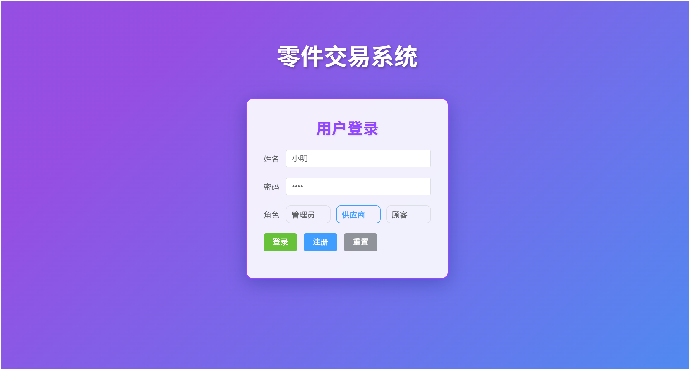
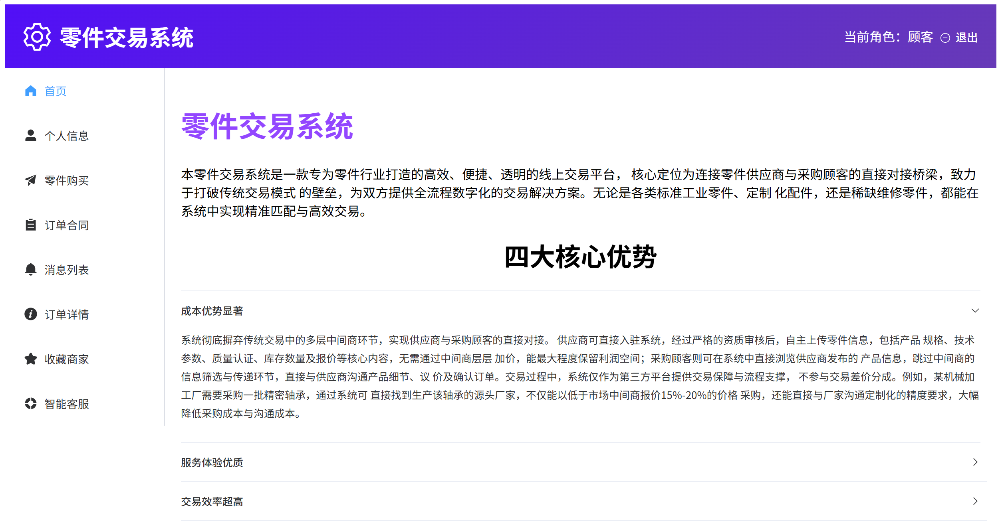
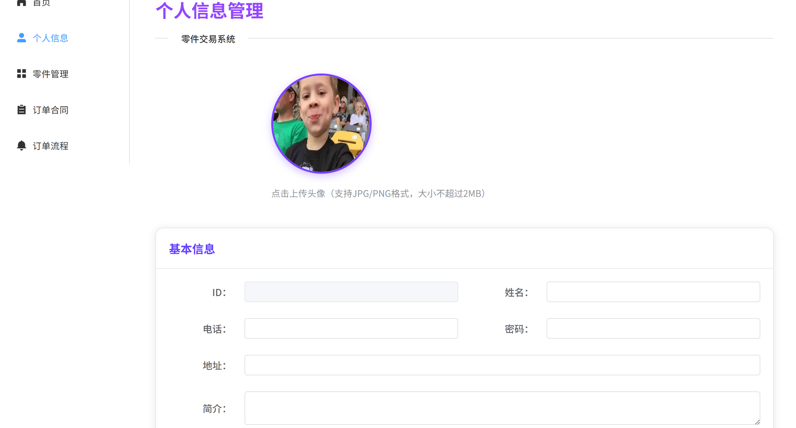
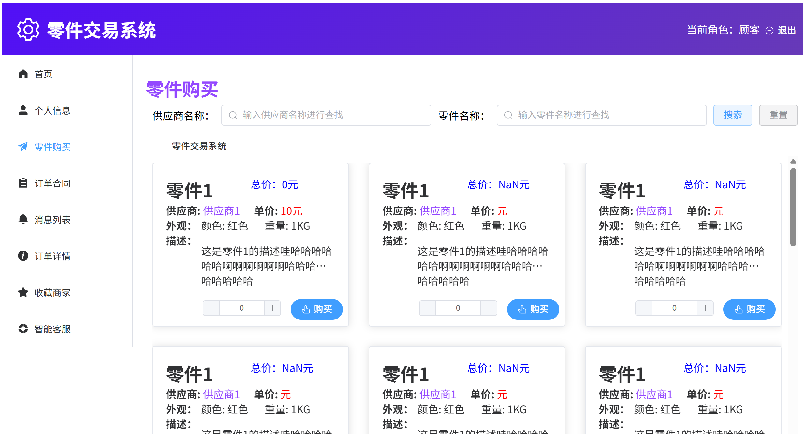
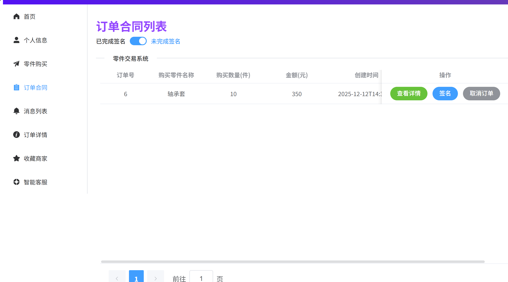
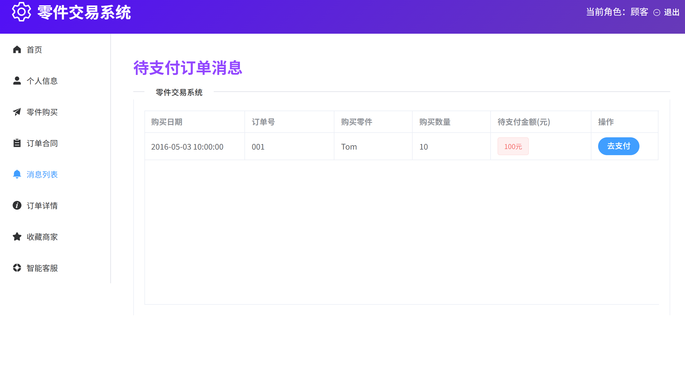
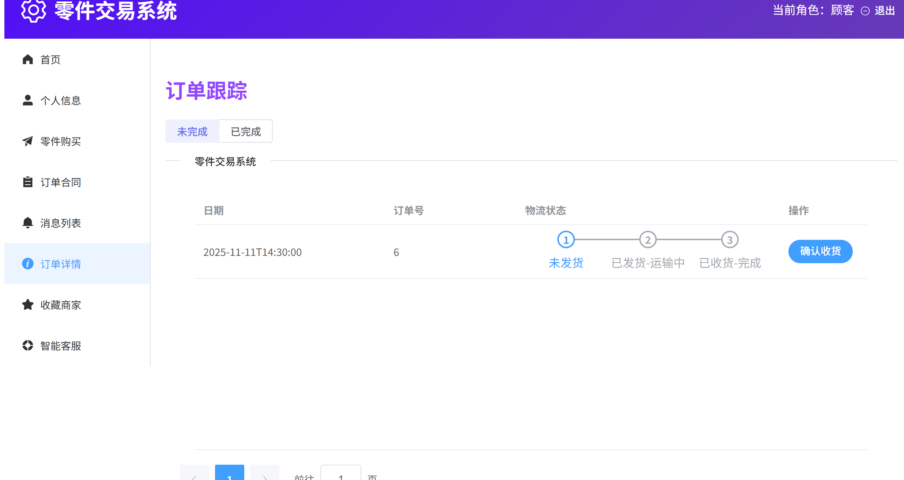
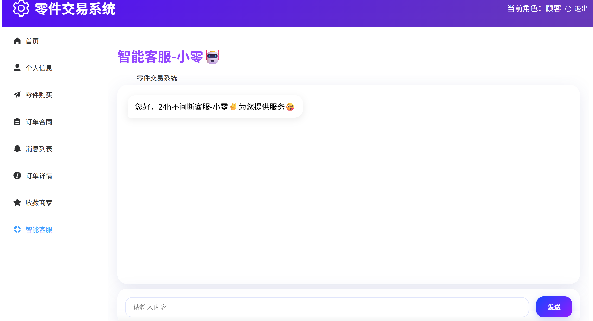
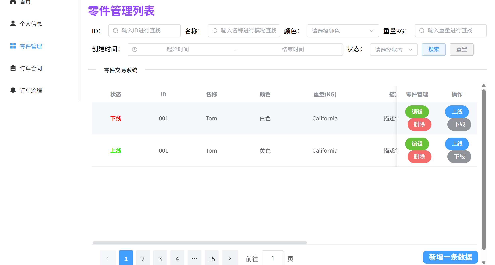
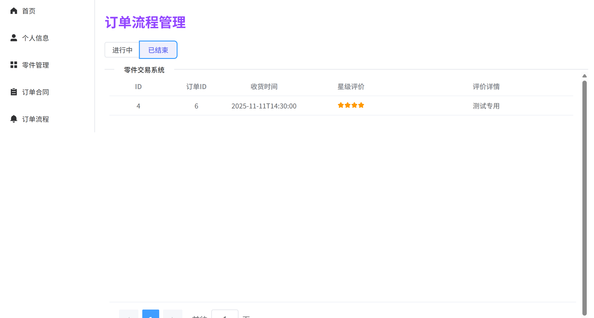
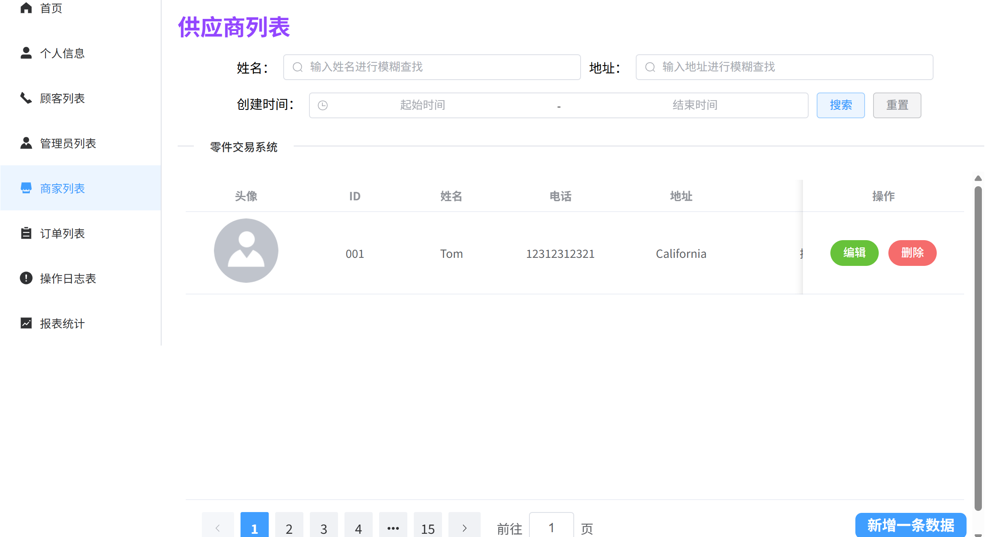
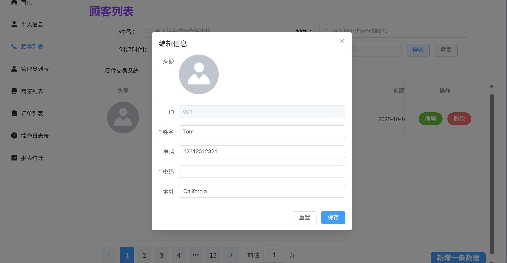
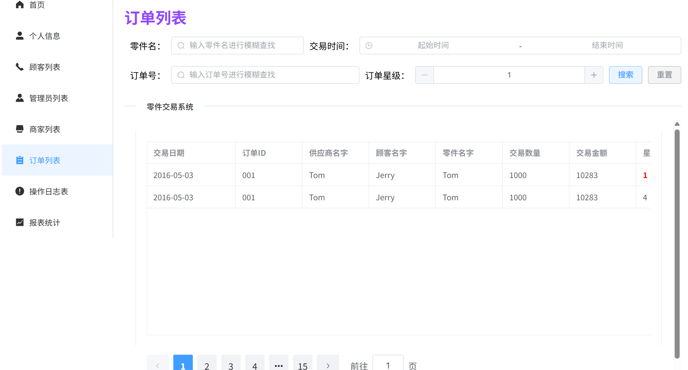
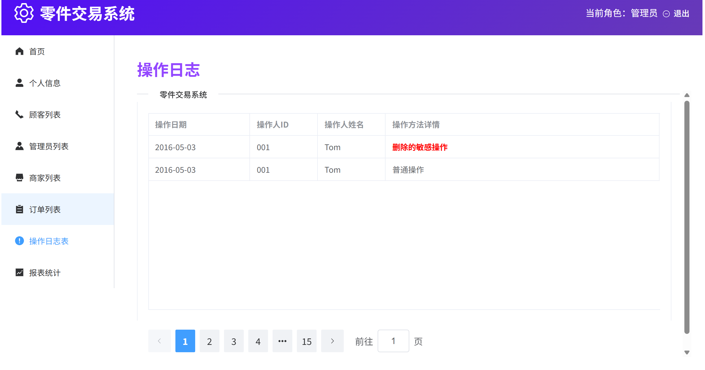
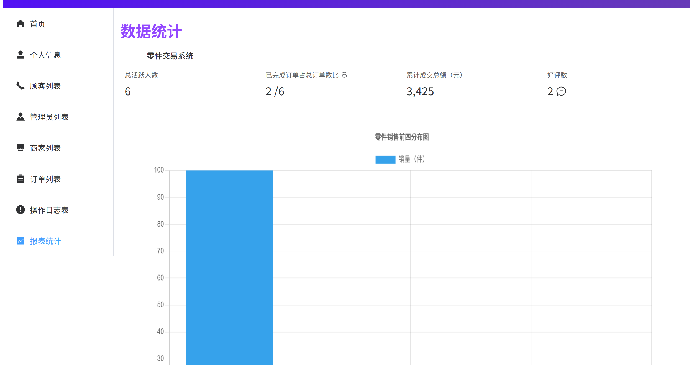


# 说明
项目为学习与实战用途，目前仅支持本地运行
代码已完整上传，可用于面试演示与学习参考