# 项目名称
**零件交易系统** 

## 项目类型

基于 Spring Boot + Vue3 的前后端分离的零件交易管理 + 智能客服系统，属于电商类型项目。

> 该项目作为数据库系统综合实践课程设计项目。

## 项目简介

本项目针对传统零件交易模式中信息不对称、流程不规范、安全性不足等问题，设计并实现了一套零件交易中心管理系统。系统以"数字化协同交易"为核心目标，支持**供应商、顾客、系统管理员**多角色协同操作，涵盖零件供应管理、求购信息发布、交易介导、电子协议签署、库存联动等核心功能。

数据库作为系统核心支撑，采用 MySQL 9.0 关系型数据库（InnoDB 引擎），通过规范化建模（第三范式）保障数据一致性，借助索引优化、权限分级、数据加密等技术提升系统性能与安全性。系统整合阿里 OSS 对象存储与百炼大模型服务，实现了交易流程的全数字化管理。

## 技术栈

### 前端
- Vue3

- Vue Router
- Pinia
- Axios
- Element Plus

### 后端
- Java17

- Spring Boot
- Spring MVC
- Spring AI
- Spring AOP
- JWT
- MyBatis
- Aliyun OSS
- MySQL
- Redis

## 核心功能

### 1. 多角色用户管理

- 支持供应商、顾客、系统管理员注册、登录、个人信息修改及密码重置
- 基于 RBAC 模型的权限控制，不同角色仅能访问自身权限范围内的数据

### 2. 零件管理

- **供应商**：添加、删除、修改零件供应信息（价格、数量、库存），支持发布/下架操作
- **顾客**：浏览在售零件，发布求购信息，收藏优质供应商

### 3. 交易与订单管理

- 订单创建、状态更新与流程追踪（待付款 → 已发货 → 已收货）
- 交易达成后自动扣减供应商库存，订单取消时恢复库存，避免超卖

### 4. 电子合同模块

- 基于订单信息自动生成电子协议书
- 支持供应商与顾客在线电子签名
- 合同存档与查询

### 5. 智能客服

- 集成 Spring AI + 百炼大模型（Qwen）
- 支持智能对话、工具调用（Tools Calling）与自动回复
- 可查询在售零件并协助用户快速下单等自动化操作

### 6. 系统管理

- 管理员对用户角色的增删改查管理
- 操作日志记录（敏感操作突出展示）
- 月度交易统计报表（交易量、热门零件、活跃用户）

## 项目亮点

1. **完整的多角色交易流程**：覆盖从零件发布、求购、供需匹配、合同签署到订单跟踪、评价的全流程，各环节数据通过数据库主外键约束保持联动与一致性。
2. **规范化数据库设计**：包含 10 张核心表，遵循第三范式设计，通过主键、外键约束保障数据一致性；采用索引优化（主键索引、联合索引、外键索引）提升查询效率；订单表支持按月分区。
3. **库存联动机制**：基于 MySQL 事务（ACID 特性）实现库存自动扣减与恢复，库存不足时禁止下单并自动下架零件，确保数据一致性。
4. **AI 智能客服集成**：结合 Spring AI 与阿里百炼大模型，实现自然语言查询与工具调用，辅助用户快速获取零件信息。
5. **多层安全防护**：用户密码采用 SHA-256 加密存储；通过参数化查询防范 SQL 注入；基于 RBAC 实现权限隔离；记录管理员操作日志支持行为审计。
6. **前后端分离架构**：后端提供 RESTful API，前端基于 Vue3 构建，提高开发效率与系统可维护性。


# 本地运行方式

## 一、前端代码运行说明

### 1. 依赖环境
- Node.js 版本：v18.16.0

- npm（包管理工具）版本：9.6.6

### 2. 本地运行步骤
1. 将代码文件拷贝到本地文件夹下

2. 使用 VS Code 打开并进入项目根目录

3. 打开命令行窗口，执行以下命令安装所需依赖：

    ```Bash
    npm install
    ```

4. 依赖安装完成后，执行以下命令启动开发服务器：

    ```Bash
    npm run dev
    ```

5. 启动成功后，可在浏览器访问以下地址：

    ```Plain Text
     http://localhost:5173/
    ```

## 二、后端代码运行说明

### 1. 前置准备

#### （1）阿里平台相关配置
1. 登录阿里平台：[https://www.aliyun.com/](https://www.aliyun.com/)

2. OSS 对象存储配置（环境变量中设置以下参数）：

    ```Plain Text
    ENDPOINT=https://oss-cn-beijing.aliyuncs.com;
	BUCKET_NAME=你的bucketName;
	REGION=你的bucket所在地区（上面的endpoint也需要对应）
    ```

    注：OSS 配置具体详细过程此处省略

3. 大模型服务平台百炼配置：

    - 创建个人密钥

    - 在环境变量中配置以下参数：

        ```Plain Text
        QWEN_API_KEY=你的api-key
        ```

#### （2）数据库配置
1. 创建数据库 `part_trade_system`

2. 通过提供的 SQL 文件创建对应数据库表（含以下测试数据）：

    - 管理员账号：root，密码：1234

    - 顾客账号：顾客小明，密码：1234

    - 供应商账号：供应商小明，密码：1234

### 2. 本地运行步骤
1. 将代码文件拷贝到本地文件夹下

2. 使用 IntelliJ IDEA 打开并进入项目

3. 修改 `application.yml` 文件中的数据库相关配置

4. 打开 `PartTradeSystemApplication.java` 文件，启动项目即可


# 项目部分运行截图
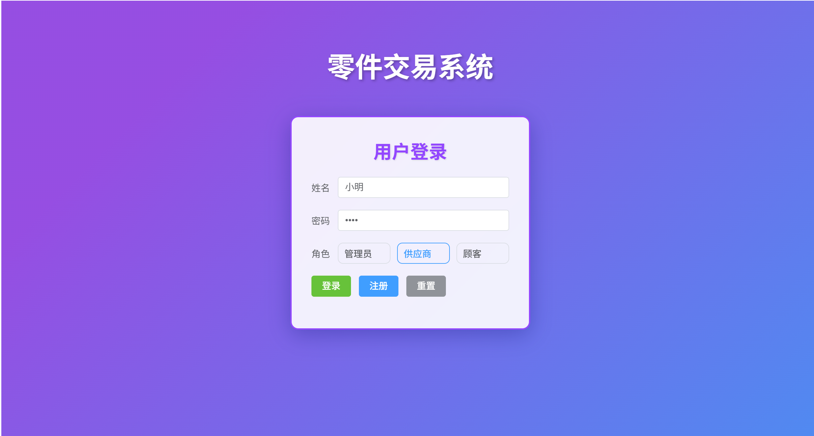
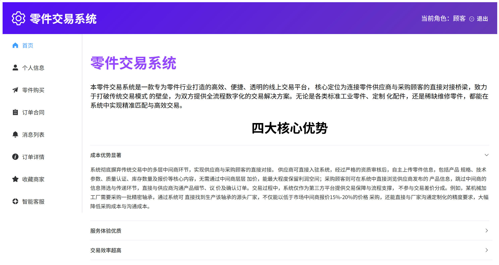
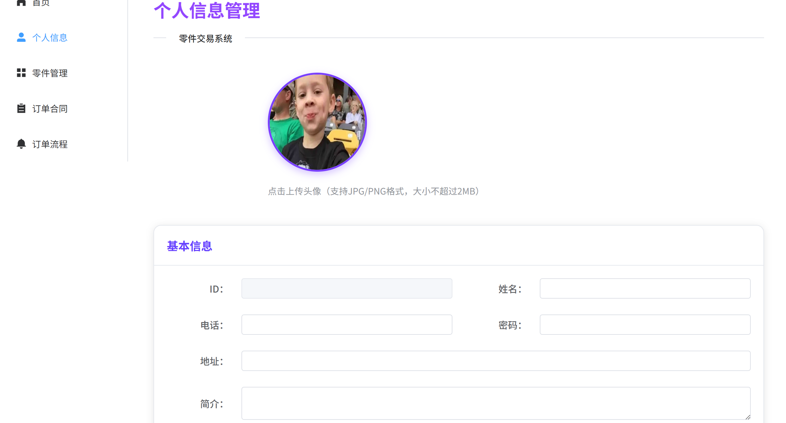
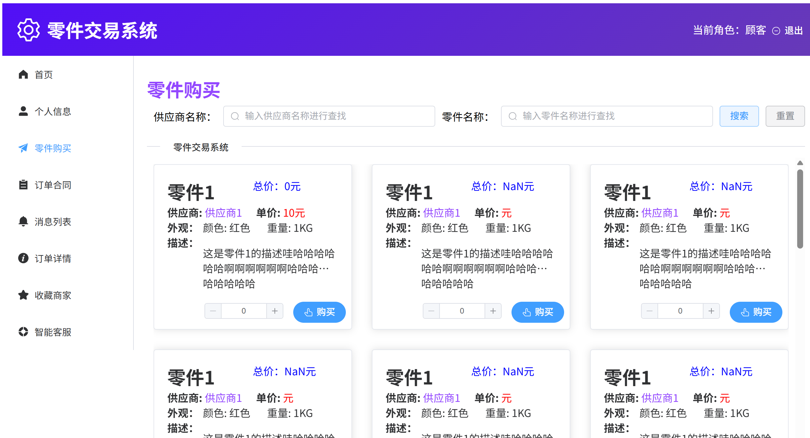
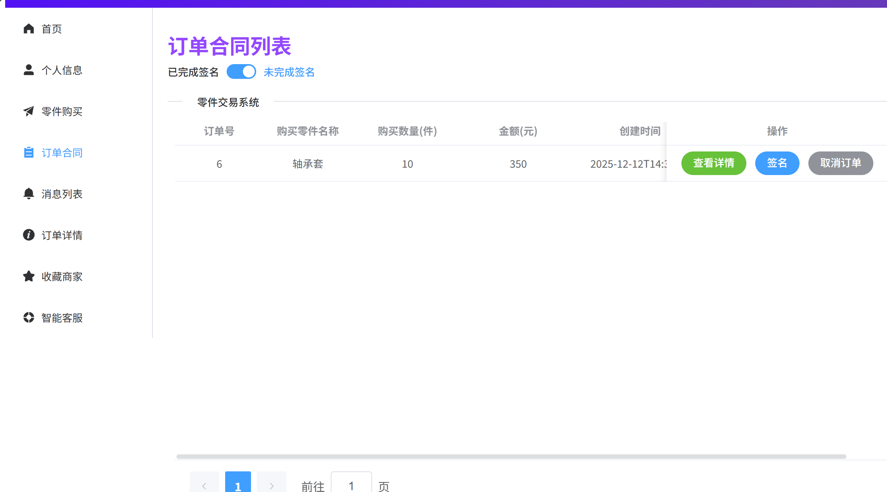
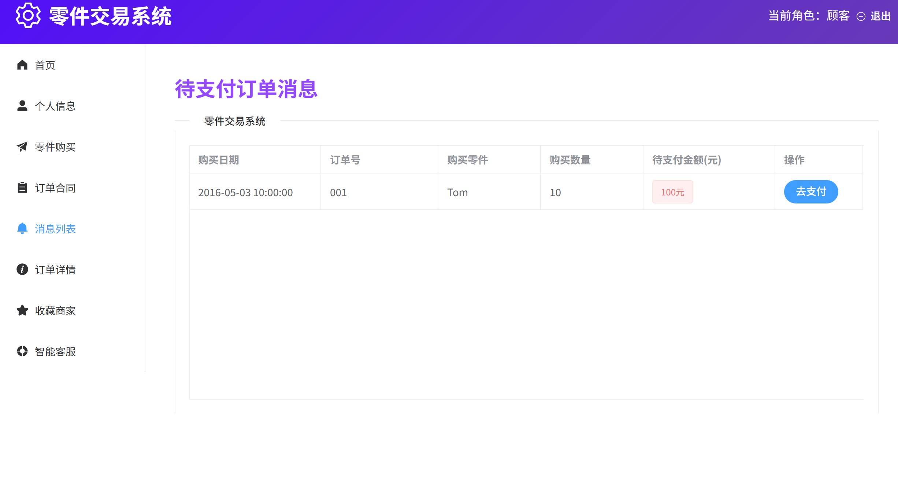
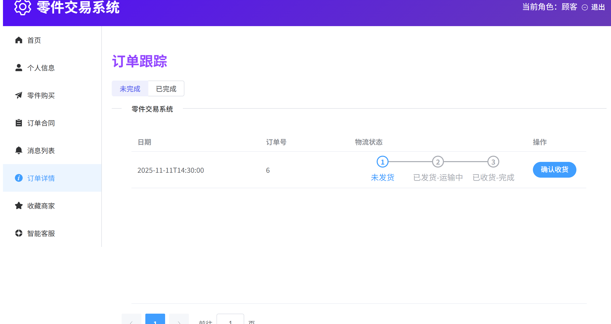
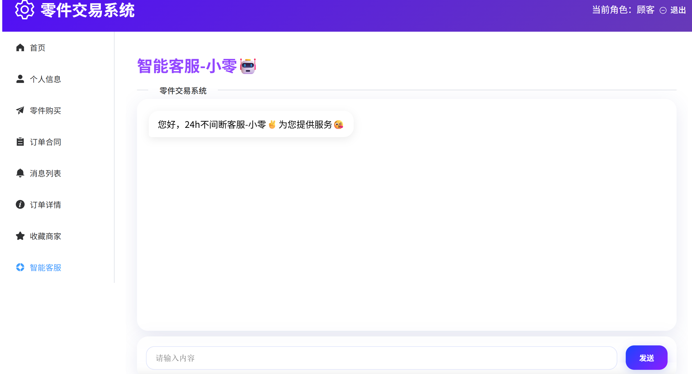
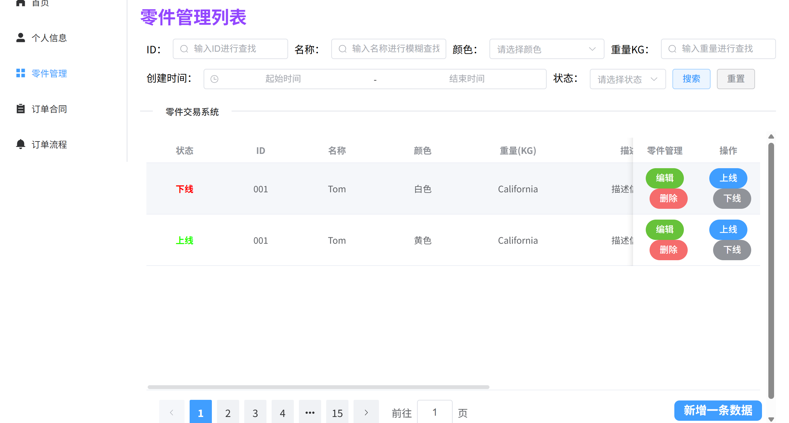
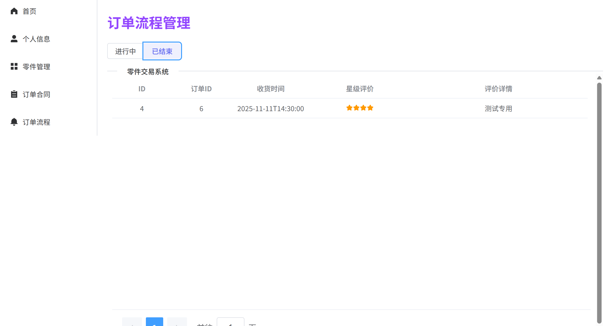
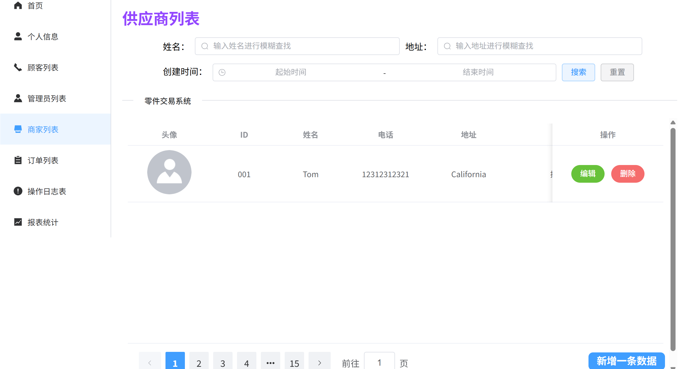
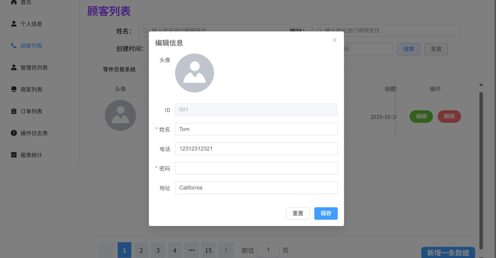
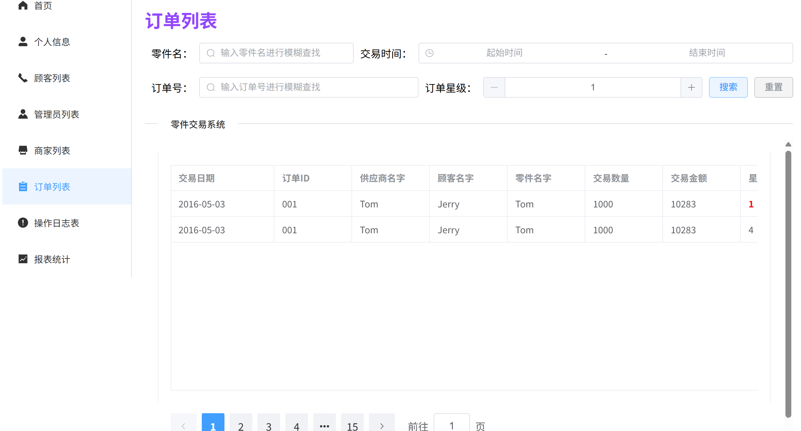
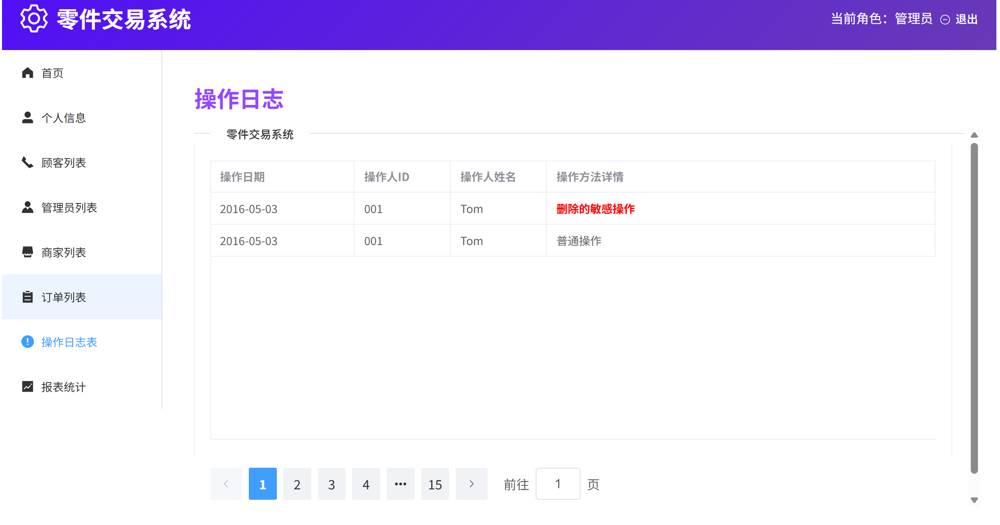
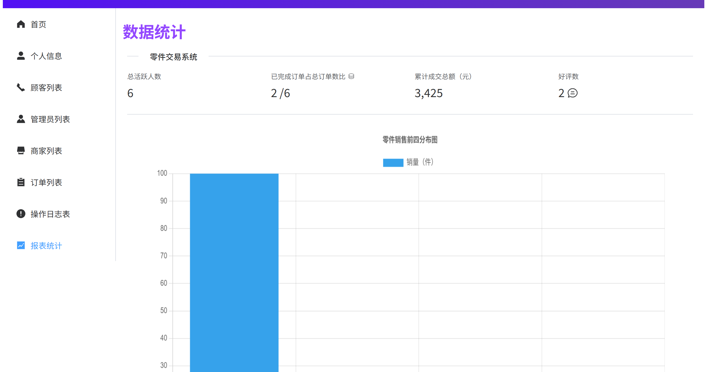


# 说明
项目为学习用途，目前仅支持本地运行
代码已完整上传，可用于演示与学习参考